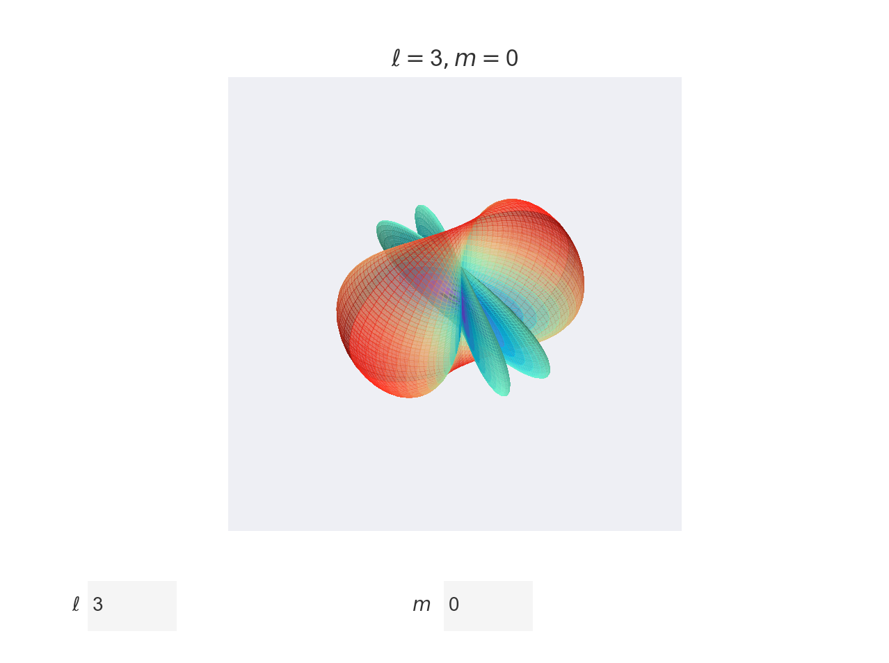

# quantum-visuals

This is a repository where I'll create some fun stuff relating to quantum mechanics.
It'll probably be written mostly in Python. 
Feel free to copy, distribute and modify as you please but leave a reference to this repo

## spherical_harmonics.py

Creates a matplotlib figure displaying the spherical harmonics $ Y_\ell^m(\theta, \phi) $. 
Beware that $ \ell $ must be a non-negative integer 
and $ m $ must be an integer in the range $ [-\ell, \ell] $. 

At the top of the code you can change the variable `resolution`. 
Higher values make prettier graphs but less responsive plots.
Tune according to taste.

Below is an example with $ \ell = 3, m = 0 $.

